<h2 align="center">Jurtaka Hiking Forum</h2>

[Find the project here.](https://jurtaka-f9d15d94d51b.herokuapp.com/)

This web application is a forum designed for hikers navigating the Jurtaka trail along the Baltic coast. Developed as a learning project using Django, it emphasizes secure user authentication and efficient content management. The platform supports user-generated content such as posts and comments, facilitating community interaction. It features responsive design for accessibility across devices and includes robust search functionality and intuitive navigation. Admin tools are provided for effective site management and content moderation.

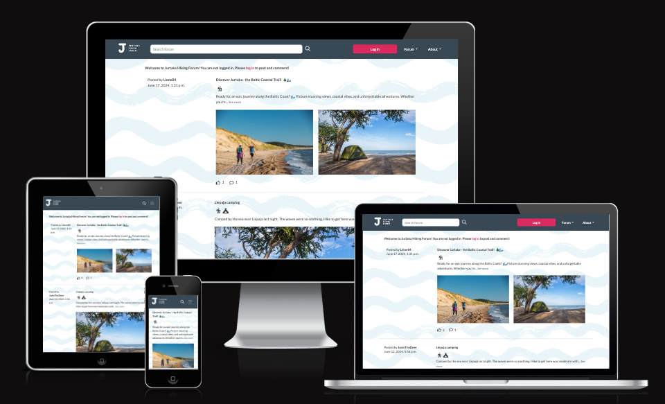

## Table of Contents

1. [Project Description](#1-project-description)
2. [User Experience](#2-user-experience)
    - [Agile Methodology](#agile-methodology)
    - [User Stories](#user-stories)
    - [Wireframes and Design](#wireframes-and-design)
3. [Site Structure](#3-site-structure)
4. [Features](#4-features)
    - [Existing Features](#existing-features)
    - [Future Features](#future-features)
5. [Technologies Used](#5-technologies-used)
    - [Languages and Frameworks Used](#languages-and-frameworks-used)
    - [Frameworks, Libraries and Programs Used](#frameworks-libraries-and-programs-used)
6. [Validation and Testing](#6-validation-and-testing)
7. [Bugs and Fixes](#7-bugs-and-fixes)
8. [Deployment](#8-deployment)
    - [Deployment to Heroku](#deployment-to-heroku)
    - [Cloning and Forking the Repository](#cloning-and-forking-the-repository)
9. [Credits](#9-credits)

# 1. Project Description

Jurtaka is an engaging and interactive forum specifically designed for hiking enthusiasts exploring the Baltic coast trail known as Jurtaka. This platform connects hikers, providing a space to share experiences, seek advice, and engage with the Jurtaka hikers community.

### Key features

- **Community Engagement**: Jurtaka fosters a lively environment where users can share their hiking stories, ask questions, and offer advice. The platform is built to enhance interaction among hikers, making it easy to connect with others who share the same passion.
- **Content Management**: The forum is well-organized, allowing users to browse through various posts and categories effortlessly. This ensures that users can find relevant information and contribute their own experiences seamlessly.

### Site goals

- Provide information about the Jurtaka trail.
- Offer tips, advice, and experiences shared by fellow hikers to help users prepare for their hike.
- Create a platform where users can share their hiking experiences, post comments, and engage in discussions.
- Encourage active participation through features like liking posts and adding categories to posts.
- Ensure the site is visually appealing and easy to navigate, with features like pagination, post previews, and categorized browsing.
- Provide search functionality to help users find specific topics of interest quickly and easily.
- Allow users to manage their own content by enabling them to create, edit, and delete their posts.
- Ensure site admins have the tools to maintain the quality and accuracy of the content on the forum.
- Attract new users by providing valuable information and a welcoming community environment.
- Provide up-to-date information and respond to user inquiries promptly to support a reliable and trustworthy forum.

### The Ideal User

The ideal user of the Jurtaka forum is a hiking enthusiast with an interest in exploring the Baltic coast trail known as Jurtaka. This user could be:

First-Time Visitor: Someone who is new to the Jurtaka trail and is looking for information, tips, and community insights about the hike.
Returning Visitor: A hiker who has already visited the forum, found valuable information, and is coming back for more detailed discussions, updates, and to share their own experiences.
Frequent User: A regular participant who actively engages with the community by contributing posts and comments. This user values the interactive nature of the forum and enjoys being a part of the vibrant hiking community.

[Return to contents list](#table-of-contents)

# 2. User Experience

## Agile Methodology

A project named 'Jurtaka Forum' was created to facilitate the planning and management of the app's development process. See the project [here](https://github.com/users/lienebriede/projects/8).

Agile values and principles have been followed in the creation of this project for educational purposes. Common Agile practices such as Epics, User Stories, Story Points and prioritization have been implemented.

### Kanban Board

There have been 42 issues managed on the Kanban board, encompassing Epics, User Stories and Bugs. 
Throughout the project, encountered bugs were either integrated into existing user stories with a bug label or tracked separately with a dedicated bug label. By the project's conclusion, all implemented requirements were moved to the 'Done' column (excluding Epics, 'Won't Have' items and issue [#44](https://github.com/users/lienebriede/projects/8/views/1?pane=issue&itemId=69943676)).

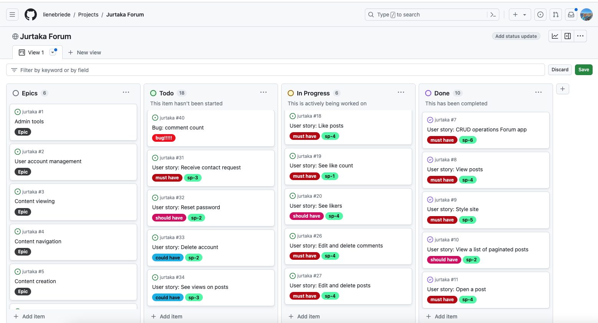


### Epics

User Stories were devided into 6 Epics.

| Epic | Issue | User Stories |
| ---- | ----- | ------------ |
| Admin Tools | [#1](https://github.com/lienebriede/jurtaka/issues/1) | [#7](https://github.com/lienebriede/jurtaka/issues/7) / [#28](https://github.com/lienebriede/jurtaka/issues/28) / [#31](https://github.com/lienebriede/jurtaka/issues/31) |
| User Account Management | [#2](https://github.com/lienebriede/jurtaka/issues/2) | [#13](https://github.com/lienebriede/jurtaka/issues/13) / [#30](https://github.com/lienebriede/jurtaka/issues/30) / [#32](https://github.com/lienebriede/jurtaka/issues/32) / [#33](https://github.com/lienebriede/jurtaka/issues/33) |
| Content Viewing | [#3](https://github.com/lienebriede/jurtaka/issues/3) | [#8](https://github.com/lienebriede/jurtaka/issues/8) / [#11](https://github.com/lienebriede/jurtaka/issues/11) / [#12](https://github.com/lienebriede/jurtaka/issues/12) / [#14](https://github.com/lienebriede/jurtaka/issues/14) / [#15](https://github.com/lienebriede/jurtaka/issues/15) / [#19](https://github.com/lienebriede/jurtaka/issues/19) / [#20](https://github.com/lienebriede/jurtaka/issues/20) / [#29](https://github.com/lienebriede/jurtaka/issues/29) / [#34](https://github.com/lienebriede/jurtaka/issues/34) / [#35](https://github.com/lienebriede/jurtaka/issues/35) / [#37](https://github.com/lienebriede/jurtaka/issues/37)  |
| Content Navigation | [#4](https://github.com/lienebriede/jurtaka/issues/4) | [#9](https://github.com/lienebriede/jurtaka/issues/9) /[#10](https://github.com/lienebriede/jurtaka/issues/10) / [#21](https://github.com/lienebriede/jurtaka/issues/21) / [#22](https://github.com/lienebriede/jurtaka/issues/22) / [#24](https://github.com/lienebriede/jurtaka/issues/24) / [#25](https://github.com/lienebriede/jurtaka/issues/25)  |
| Content Creation | [#5](https://github.com/lienebriede/jurtaka/issues/5) | [#17](https://github.com/lienebriede/jurtaka/issues/17) /[#23](https://github.com/lienebriede/jurtaka/issues/23) / [#38](https://github.com/lienebriede/jurtaka/issues/38) / [#39](https://github.com/lienebriede/jurtaka/issues/39)  |
| Content Interaction | [#6](https://github.com/lienebriede/jurtaka/issues/6) | [#16](https://github.com/lienebriede/jurtaka/issues/16) / [#18](https://github.com/lienebriede/jurtaka/issues/18) / [#26](https://github.com/lienebriede/jurtaka/issues/26) / [#27](https://github.com/lienebriede/jurtaka/issues/27) / [#36](https://github.com/lienebriede/jurtaka/issues/36) |


### MoSCoW Prioritisation and Story Points

The user stories were prioritized using the MoSCoW method. Story Points were assigned for each User Story to indicate their relative complexity or effort. The MoSCoW prioritization categorizes requirements as follows:

- **Must-Have**: Critical requirements necessary for the project's success.

- **Should-Have**: Important requirements that add significant value but are not critical.

- **Could-Have**: Desirable features that are nice to have but not essential.

- **Won't-Have**: Features explicitly excluded from the project scope.

Additionally, labels were used to denote both the story points and MoSCoW priorities throughout the project's lifecycle.

A total of **100** story points were allocated across the project's user stories:

| Priority | Story Points |
|----------|--------------|
| Must-Have | 60           |
| Should-Have | 24         |
| Could-Have | 16          |

By the project's completion, 17 story points in total were categorized as 'Won't-Have' due to project constraints.

Since this project serves educational purposes, it's important to note that the assigned story points may not always accurately reflect the actual effort required. Some tasks may have required more time, while others may have required less.

[Return to contents list](#table-of-contents)

## User Stories

The user stories in this project are categorized into three main roles: Registered Site Users, New Site Users, and Site Administrators (Admins). Each category represents specific functionalities and features tailored to enhance the experience and management of the forum site:

- Registered Site Users: Stories focusing on functionalities available to users who have registered an account. These include activities such as commenting, posting, liking content and interacting with other community members.

- New Site Users: Stories designed to accommodate users who are new to the site. These encompass features like viewing posts, navigating through categorized content, searching for specific topics, and interacting with the forum in a streamlined and user-friendly manner.

- Site Admins: Stories that empower administrators with tools to manage and oversee the forum site effectively. Admin-related features include content creation, moderation, managing site information, handling user inquiries via a contact form, and ensuring the overall functionality and appeal of the forum site.

<details>
<summary>
View the list of User Stories categorized by role:</summary>

### Registered Site Users

- As a **Registered Site User** I can comment on posts so that I can engage with the author and the forum community [issue #16](https://github.com/lienebriede/jurtaka/issues/16) must have

- As a **Registered Site User** I can write posts so that I can engage with the forum [issue #17](https://github.com/lienebriede/jurtaka/issues/17) must have

- As a **Registered Site User** I can like posts so that I can engage with the post author and the forum community [issue #18](https://github.com/lienebriede/jurtaka/issues/18) must have

- As a **Registered Site User** I can see who has liked the posts so that I can understand the forum community [issue #20](https://github.com/lienebriede/jurtaka/issues/20) should have

- As a **Registered Site User** when I am posting I can add categories to posts so that I can categorise my post [issue #23](https://github.com/lienebriede/jurtaka/issues/23) should have

- As a **Registered Site User** I can edit and delete my comment so that I can update content of my comment or remove comments that are not relevant [issue #26](https://github.com/lienebriede/jurtaka/issues/26) must have

- As a **Registered Site User** I can update and delete my posts so that I can update the content of my post or remove posts that are not relevant [issue #27](https://github.com/lienebriede/jurtaka/issues/27) must have

- As a **Registered Site User** I can reset my password so that I can change my password if it's forgotten [issue #32](https://github.com/lienebriede/jurtaka/issues/32) should have

- As a **Registered Site User** I can delete my account so that I can opt out from all the services [issue #33](https://github.com/lienebriede/jurtaka/issues/33) could have

- As a **Registered Site User** I can rate hiking sections so that I can give feedback to other users [issue #36](https://github.com/lienebriede/jurtaka/issues/36) could have

- As a **Registered Site User** I can add hiking section to post so that I can give more detailed information to the users [issue #38](https://github.com/lienebriede/jurtaka/issues/38) could have

- As a **Registered Site User** I can add photos to posts so that the content of my post is more interactive [issue #39](https://github.com/lienebriede/jurtaka/issues/39) could have

- As a **Registered Site User/New Site User** I can fill in the contact form so that I can contact the forum administration [issue #30](https://github.com/lienebriede/jurtaka/issues/30) must have

### New Site Users

- As a **Registered Site User/New Site User** I can fill in the contact form so that I can contact the forum administration [issue #30](https://github.com/lienebriede/jurtaka/issues/30) must have

- As a **New Site User** I can view a list of posts so that I can read the forum [issue #8](https://github.com/lienebriede/jurtaka/issues/8) must have

- As a **New Site User** I can see a visually appealing site so that I have an enjoyable visual experience [issue #9](https://github.com/lienebriede/jurtaka/issues/9) must have

- As a **New Site User** I can see a paginated list of posts so that I can navigate the site easily [issue #10](https://github.com/lienebriede/jurtaka/issues/10) should have

- As a **New Site User** I can open a post so that I can read the full post and the comments [issue #11](https://github.com/lienebriede/jurtaka/issues/11) must have

- As a **New Site User** I can see only the first few lines of the posts so that I can quickly scan the posts to decide which wants I want to read [issue #12](https://github.com/lienebriede/jurtaka/issues/12) should have

- As a **New Site User** I can register an account so that I can interact with the forum [issue #13](https://github.com/lienebriede/jurtaka/issues/13) must have

- As a **New Site User** I can read comments on posts so that I can see the feedback of the forum community [issue #14](https://github.com/lienebriede/jurtaka/issues/14) must have

- As a **New Site User** I can see how many comments are left on a post so that I know how popular a post is [issue #15](https://github.com/lienebriede/jurtaka/issues/15) should have

- As a **New Site User** I can see how many likes are left on a post so that I know how popular a post is [issue #19](https://github.com/lienebriede/jurtaka/issues/19) must have

- As a **New Site User** I can see the posts categorised by the most popular post so that I can see most useful posts first [issue #21](https://github.com/lienebriede/jurtaka/issues/21) should have

- As a **New Site User** I can browse the posts by category so that I can navigate the site easier [issue #22](https://github.com/lienebriede/jurtaka/issues/22) should have

- As a **New Site User** I can search the forum so that I can find posts on topics that I am interested in [issue #24](https://github.com/lienebriede/jurtaka/issues/24) should have

- As a **New Site User** when I use the search bar I can see the search results highlighted so that I can find my topics easily [issue #25](https://github.com/lienebriede/jurtaka/issues/25) should have

- As a **New Site User** I can visit the About site so that I can learn about the forum and the forum community [issue #29](https://github.com/lienebriede/jurtaka/issues/29) must have

- As a **New Site User** I can see how many times a post has been viewed so that I can see how popular the post it [issue #34](https://github.com/lienebriede/jurtaka/issues/34) could have

- As a **New Site User** I can see a list of all the sections of the hike so that I can learn about the hike [issue #35](https://github.com/lienebriede/jurtaka/issues/35) could have

- As a **New Site User** I can see hiking section ratings on posts so that I can see feedback from other users [issue #37](https://github.com/lienebriede/jurtaka/issues/37) could have

### Site Admins

- As a **Site Admin** I can create, read, update and delete data so that I can manage the content of the forum site [issue #7](https://github.com/lienebriede/jurtaka/issues/7) must have

- As a **Site Admin** I can manage the content on the About site so that I can provide up to date information to users [issue #28](https://github.com/lienebriede/jurtaka/issues/28) must have

- As a **Site Admin** I can receive contact requests so that I can respond to user inquiries and manage communication efficiently [issue #31](https://github.com/lienebriede/jurtaka/issues/31) must have

</details>

<details>
<summary>
View the list of User Stories categorized by User Story prioritization:</summary>

### Must Have

- As a **Site Admin** I can create, read, update and delete data so that I can manage the content of the forum site [issue #7](https://github.com/lienebriede/jurtaka/issues/7)

- As a **New Site User** I can view a list of posts so that I can read the forum [issue #8](https://github.com/lienebriede/jurtaka/issues/8)

- As a **New Site User** I can see a visually appealing site so that I have an enjoyable visual experience [issue #9](https://github.com/lienebriede/jurtaka/issues/9)

- As a **New Site User** I can open a post so that I can read the full post and the comments [issue #11](https://github.com/lienebriede/jurtaka/issues/11)

- As a **New Site User** I can register an account so that I can interact with the forum [issue #13](https://github.com/lienebriede/jurtaka/issues/13)

- As a **New Site User** I can read comments on posts so that I can see the feedback of the forum community [issue #14](https://github.com/lienebriede/jurtaka/issues/14)

- As a **Registered Site User** I can comment on posts so that I can engage with the author and the forum community [issue #16](https://github.com/lienebriede/jurtaka/issues/16)

- As a **Registered Site User** I can write posts so that I can engage with the forum [issue #17](https://github.com/lienebriede/jurtaka/issues/17)

- As a **Registered Site User** I can like posts so that I can engage with the post author and the forum community [issue #18](https://github.com/lienebriede/jurtaka/issues/18)

- As a **New Site User** I can see how many likes are left on a post so that I know how popular a post is [issue #19](https://github.com/lienebriede/jurtaka/issues/19)

- As a **Registered Site User** I can edit and delete my comment so that I can update content of my comment or remove comments that are not relevant [issue #26](https://github.com/lienebriede/jurtaka/issues/26)

- As a **Registered Site User** I can update and delete my posts so that I can update the content of my post or remove posts that are not relevant [issue #27](https://github.com/lienebriede/jurtaka/issues/27)

- As a **Site Admin** I can manage the content on the About site so that I can provide up to date information to users [issue #28](https://github.com/lienebriede/jurtaka/issues/28)

- As a **New Site User** I can visit the About site so that I can learn about the forum and the forum community [issue #29](https://github.com/lienebriede/jurtaka/issues/29)

- As a **New Site User/Registered Site User** I can fill in the contact form so that I can contact the forum administration [issue #30](https://github.com/lienebriede/jurtaka/issues/30)

- As a **Site Admin** I can receive contact requests so that I can respond to user inquiries and manage communication efficiently [issue #31](https://github.com/lienebriede/jurtaka/issues/31)

### Should Have

- As a **New Site User** I can see a paginated list of posts so that I can navigate the site easily [issue #10](https://github.com/lienebriede/jurtaka/issues/10)

- As a **New Site User** I can see only the first few lines of the posts so that I can quickly scan the posts to decide which wants I want to read [issue #12](https://github.com/lienebriede/jurtaka/issues/12)

- As a **New Site User** I can see how many comments are left on a post so that I know how popular a post is [issue #15](https://github.com/lienebriede/jurtaka/issues/15)

- As a **Registered Site User** I can see who has liked the posts so that I can understand the forum community [issue #20](https://github.com/lienebriede/jurtaka/issues/20)

- As a **New Site User** I can see the posts categorised by the most popular post so that I can see most useful posts first [issue #21](https://github.com/lienebriede/jurtaka/issues/21)

- As a **New Site User** I can browse the posts by category so that I can navigate the site easier [issue #22](https://github.com/lienebriede/jurtaka/issues/22)

- As a **Registered Site User** when I am posting I can add categories to posts so that I can categorise my post [issue #23](https://github.com/lienebriede/jurtaka/issues/23)

- As a **New Site User** I can search the forum so that I can find posts on topics that I am interested in [issue #24](https://github.com/lienebriede/jurtaka/issues/24)

- As a **New Site User** when I use the search bar I can see the search results highlighted so that I can find my topics easily [issue #25](https://github.com/lienebriede/jurtaka/issues/25)

- As a **Registered Site User** I can reset my password so that I can change my password if it's forgotten [issue #32](https://github.com/lienebriede/jurtaka/issues/32)

### Could Have

- As a **Registered Site User** I can delete my account so that I can opt out from all the services [issue #33](https://github.com/lienebriede/jurtaka/issues/33)

- As a **New Site User** I can see how many times a post has been viewed so that I can see how popular the post it [issue #34](https://github.com/lienebriede/jurtaka/issues/34)

- As a **New Site User** I can see a list of all the sections of the hike so that I can learn about the hike [issue #35](https://github.com/lienebriede/jurtaka/issues/35)

- As a **Registered Site User** I can rate hiking sections so that I can give feedback to other users [issue #36](https://github.com/lienebriede/jurtaka/issues/36)

- As a **New Site User** I can see hiking section ratings on posts so that I can see feedback from other users [issue #37](https://github.com/lienebriede/jurtaka/issues/37)

- As a **Registered Site User** I can add hiking section to post so that I can give more detailed information to the users [issue #38](https://github.com/lienebriede/jurtaka/issues/38)

- As a **Registered Site User** I can add photos to posts so that the content of my post is more interactive [issue #39](https://github.com/lienebriede/jurtaka/issues/39)
</details>

### 'Won't Have' User Stories

These User Stories have been assigned Won't-Have status.

| User Story | Original Priority | New Priority | 
|------------|-------------------|--------------|
| Edit and delete my comment [issue #26](https://github.com/lienebriede/jurtaka/issues/26) | must have* | won't have |
| Reset Password [issue #32](https://github.com/lienebriede/jurtaka/issues/32) | should have** | won't have | 
| Delete Account [issue #33](https://github.com/lienebriede/jurtaka/issues/33) | could have | won't have |
| Reset Password [issue #32](https://github.com/lienebriede/jurtaka/issues/32) | could have | won't have |
| See views on posts[issue #34](https://github.com/lienebriede/jurtaka/issues/34) | could have | won't have |
| Hiking Sections [issue #35](https://github.com/lienebriede/jurtaka/issues/35) | could have| won't have |
| Rate Hiking Sections [issue #36](https://github.com/lienebriede/jurtaka/issues/36) | could have | won't have |
| See Hiking Section ratings on Posts [issue #37](https://github.com/lienebriede/jurtaka/issues/37) | could have | won't have |
| Add hiking section to post [issue #38](https://github.com/lienebriede/jurtaka/issues/38) | could have | won't have |
| Top posts [issue #21](https://github.com/lienebriede/jurtaka/issues/21) | should have | won't have |

*The user story needed revision because the approach of adding and editing comments resulted in poor user experience. The layout of the post detail page makes editing comments in the planned manner difficult for the users, as the "add comment" field is located just below the post, while the published comment that needs editing could be at the bottom of the page. To avoid confusion, comments should be edited directly within the published comment field. This change, however, requires more story points for this user story. Ultimately, after assessing priorities and the need to focus resources on more critical 'Could-Have' features (e.g., adding images to the post), the decision was made to assign 'Won't Have' status to this user story.

**Since the users are not required to provide email address when registering for the site, this feature seemed unnesecary at this time, giving time to work on more relative features.

[Return to contents list](#table-of-contents)

## Wireframes and Design

### Wireframes

These wireframes were created during the project planning phase. Several changes have been implemented in the final application to enhance the user experience.

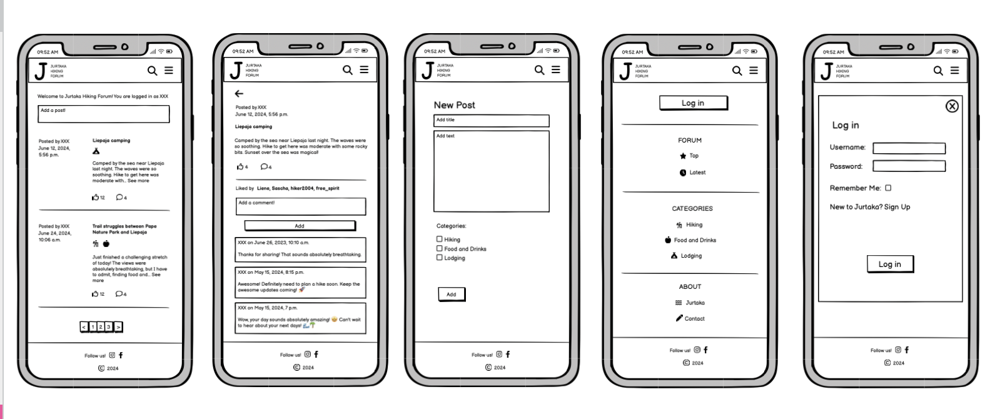
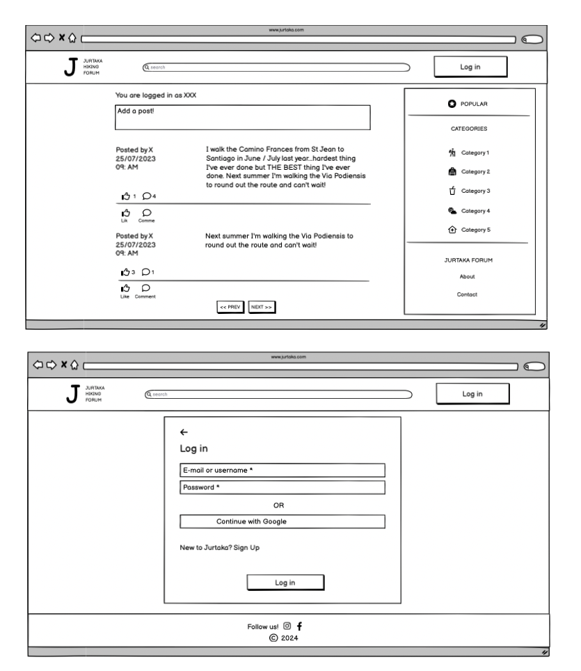

### Logo and Background Image


A simple logo was created using Adobe Illustrator. The background image, sourced from Adobe Stock images, aligns with the forum's theme. Its light design ensures it does not distract users but still enhances the forum's visual appeal and thematic coherence.

### Colour Scheme

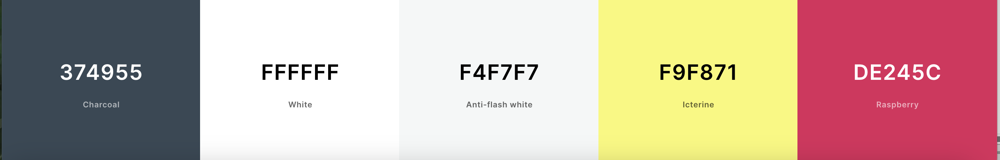

### Typography and Icons

The font used for the app is "Lato", with Sans Serif as the fallback font.
In the app, icons from Font Awesome are used to enhance its aesthetics and functionality, making it more visually appealing, user-friendly, and engaging. The icons are used for representing the categories, thumbs up for likes, and comment bubbles for comments. These icons play a crucial role in helping users quickly understand and navigate through various sections and actions within the app, contributing to a more intuitive and enjoyable user experience.

### Footer

The app includes a footer section with links to Facebook and Instagram for direct access to the forums social media profiles.

### Error Pages

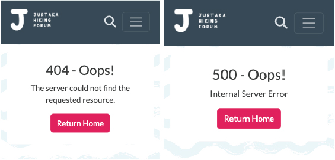

Custom error pages for both the '404 Not Found' and '500 Internal Server Error' scenarios have been implemented to enhance user experience and provide clear guidance in case of resource not found or server issues.

### Responsivness

**Search Bar**


On desktops the website displays a full search bar with a text input field and a search button for easy access, while on mobile screens it simplifies to a search icon to save space. Clicking the search icon reveals a dropdown search bar, maintaining a clean and user-friendly interface.

**Navigation Bar**

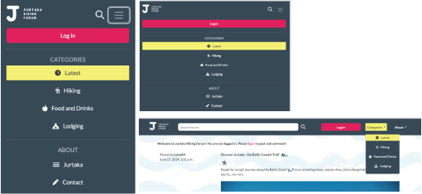

On desktops the website displays a full search bar and a detailed navigation bar with all the menu items visible and an active button highlighting the current page. On mobile devices the navigation bar is a toggle button that expands to show menu items, with the active button still highlighting the current page, ensuring a clean and user-friendly interface.

**Image Display**


The image display adapts responsively depending on the screen size. When viewing on larger screens, posts with two images are shown side by side in equal-sized columns, optimizing space and layout. On smaller screens, or when only one image is available, it expands to fill the entire width, ensuring images remain clear and well-presented while maintaining a cohesive and user-friendly browsing experience across all devices.

[Return to contents list](#table-of-contents)

# 3. Site Structure
    
### Site maps

This site map shows the intended structure of the site. The grey colored boxes relate to the 'could have' user stories or future implementations at the stage of planning.


### Database schemas

This ERD shows the intended database structure. The blue colored tables (HikeSection and HikeRating) relate to the 'could have' user stories or future implementations at the stage of planning.


### Database Schema Enhancements

Some changes were implemented to the database schemas. 

- The "Post" model has been implemented with a field **'has_been_edited'** Boolean field to differentiate between original and edited posts. This addition enables to display the "updated_on" date only for posts that have been edited.  

- The "Contact" model has been implemented with an **'email'** field to make it possible for unregistered users to provide their contact information. Setting 'null=True, blank=True' allows this field to be optional, allowing both registered and unregistered users to submit the form. 

- The **'reason'** field has been removed from the "Contact" model. Since the contact form already includes a **'subject'** field, having two separate fields for subject and reason is redundant for submitting contact inquiries.

- Both the "Post" and "About" models have been implemented with  Cloudinary **'image'** fields. This allows admins to upload an image for the "About" page and the users to add one or two images to their posts.

[Return to contents list](#table-of-contents)

# 4. Features

## Existing Features

**Home Page**

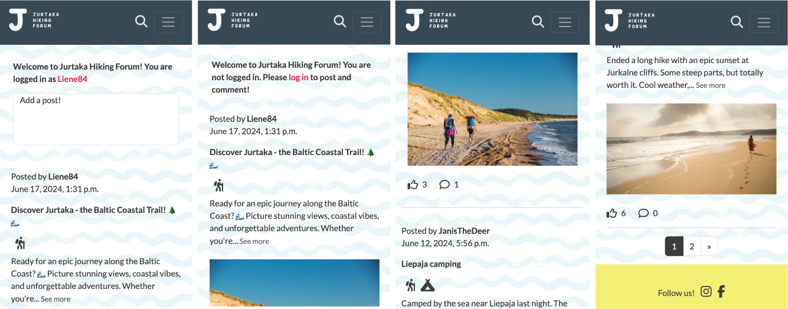

1. New users see a welcome message encouraging them to log in.
2. Returning users receive a personalized greeting upon logging in.
3. Users add new posts in the designated "Add a post" section.
4. Each post displays its content along with the comment and like count.
5. The categories associated with each post are shown.
6. Pagination ensures smooth navigation through posts.
7. A post preview option allows users to quickly glance at the post content.

**Individual Post Display**

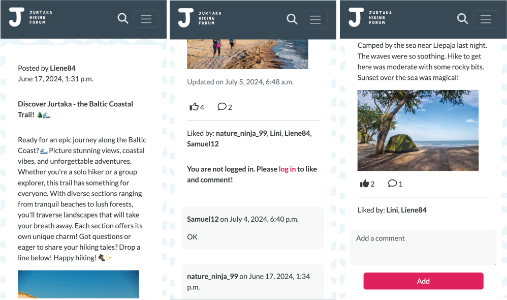
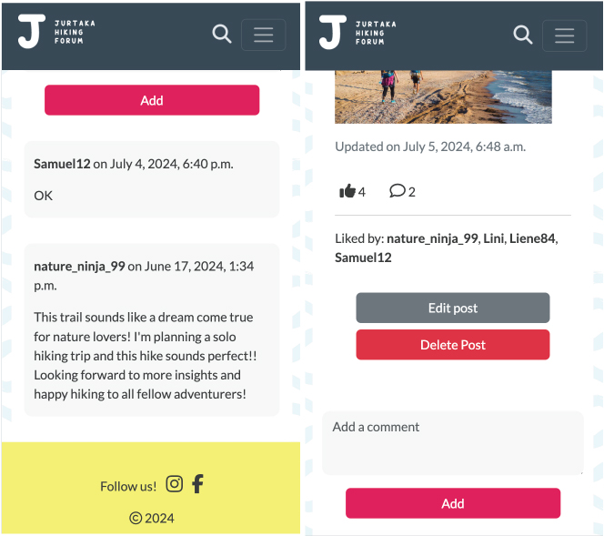

1. Each post shows the username of the author and the date it was posted.
2. The title and full content of the post are displayed, along with one or two images.
3. If the post has been updated, the update date is shown in grey.
4. Users see the like and comment count for each post.
5. The like button changes from outlined to black if the user has liked the post.
6. A list of users who liked the post is available.
7. Logged-in users can add comments to posts.
8. Users who are not logged in see a prompt to log in to add comments.
9. The comments section displays all comments on the post.
10. Post authors have the option to edit and/or delete their posts.

**Add a Post**


1. Clicking the "Add a post" field opens a new post page.
2. An exit button on the new post page allows users to return to the home page.
3. The form requires users to fill in the title, content, and categories.
4. Missing title and content fields trigger an error message.
5. A missing category prompts a Django error message and a required field message.
6. Upon successful submission, a Django success message is displayed.

**Edit and Delete Post**

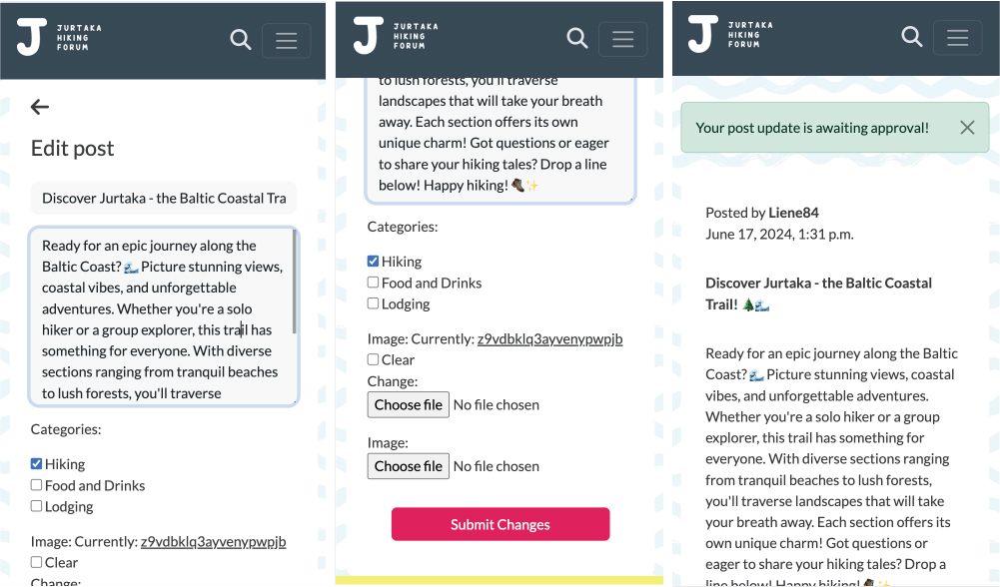
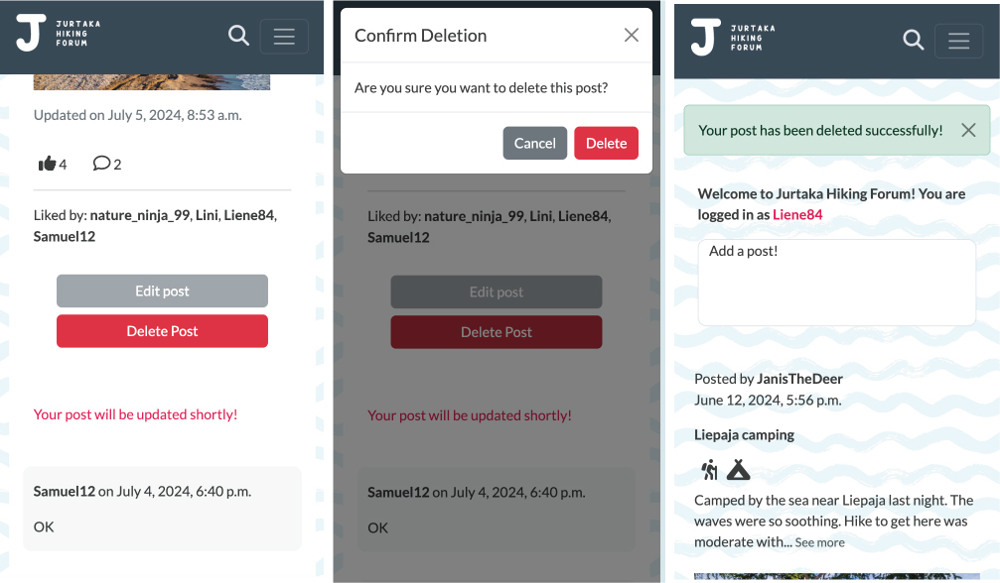

1. Clicking the "Edit post" button opens the edit post page.
2. An arrow left button allows users to return to the individual post view.
3. Users can edit all fields, including title, content, category, and images.
4. All required fields must be filled; otherwise, error messages appear.
5. Upon successful submission, a Django success message is displayed.
6. After submission, the edit button is disabled.
7. The add comment section is hidden with a message indicating that the post will be updated shortly.
8. The post does not appear on the post list until approved by the admin.
9. The user can still delete the post after editing.
10. Clicking on delete post triggers a confirmation modal.
11. After feleting the post, the user is redirected to the home page.

**Like and Comment**

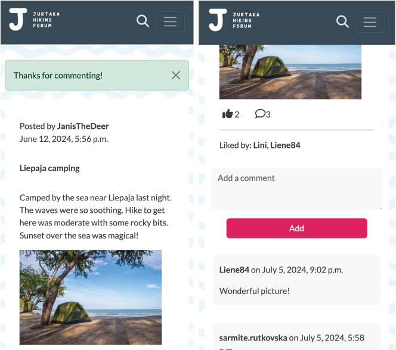

1. Users can add comments to posts.
2. Upon successful submission, a Django success message is displayed.
3. Users can like and unlike a post. The like button changes from outlined to black if the user has liked the post.

**Search Functionality**

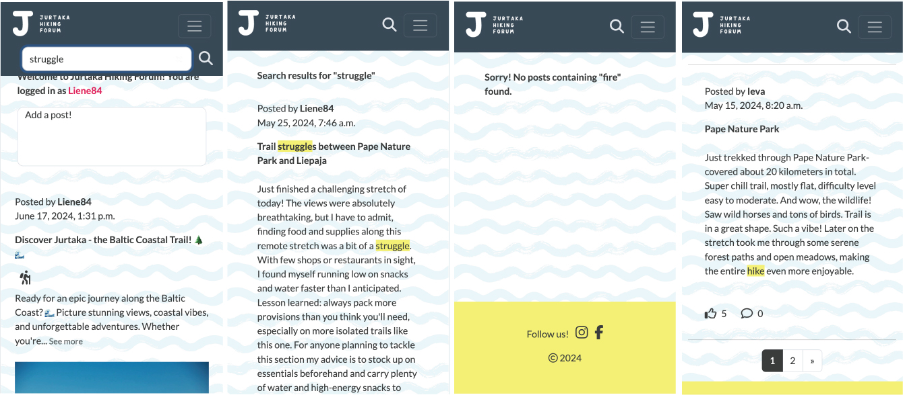

1. Users can search for keywords within the app.
2. Posts containing the keyword in the title or content are shown.
3. The keyword is highlighted in yellow within the search results.
4. If no match is found, a message indicates no such keyword.
5. Pagination is available for the search results.

**Navigation**

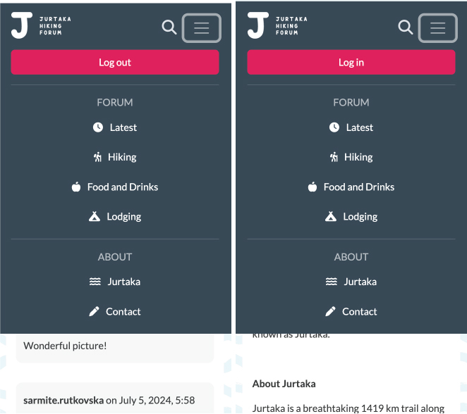

1. Users can browse posts by various categories.
2. The default view shows the latest posts.
3. Users can view top posts in a dedicated category.
4. Posts can belong to multiple categories, and all relevant posts are displayed.
5. The navigation bar shows either log in or log out buttons depending on the user's status.

**Log in/Log out Page**

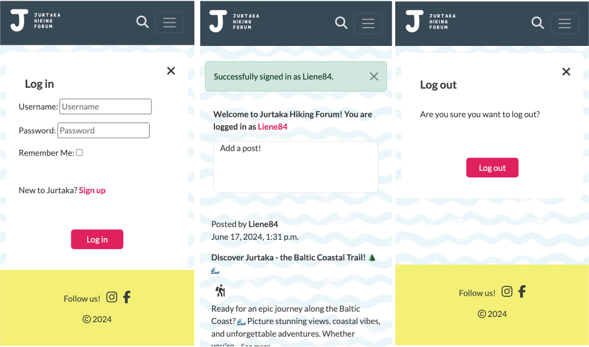
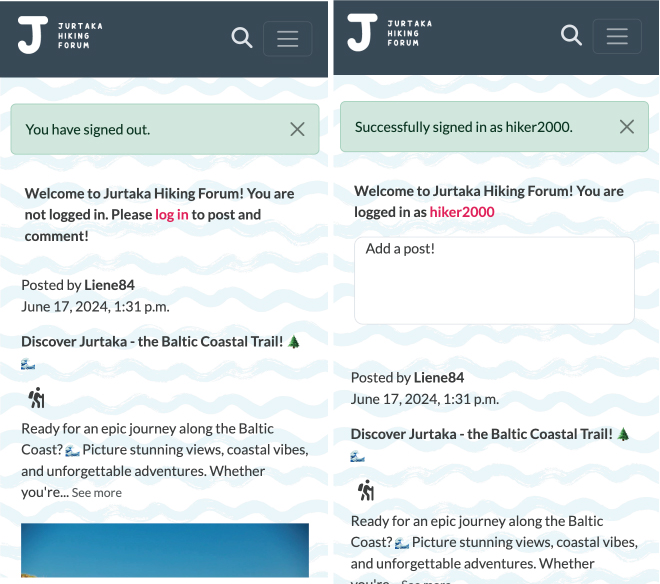

1. The app uses Django's built-in authentication system with required fields.
2. The log in page offers the option to register an account if the user is not logged in.
3. An exit button on the log in/log out page allows users to return to the home page.

**About Page**

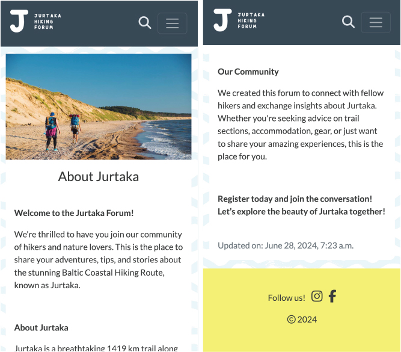

1. The about page provides information about the app.
2. The content on the about page can be updated by the admin.

**Contact Page**

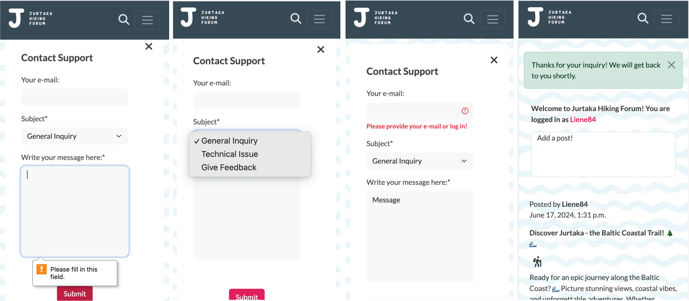

1. Both logged-in and not logged-in users can send a request form through the contact page.
2. The form requires a message and a subject, with the subject defaulting to "general inquiry."
3. Logged-in users do not need to provide an email address.
4. Unregistered users must include their email address in the form.
5. Upon successful form submission, a Django success message appears.
6. The user is redirected to the home page after form submission.

**Admin Controls**

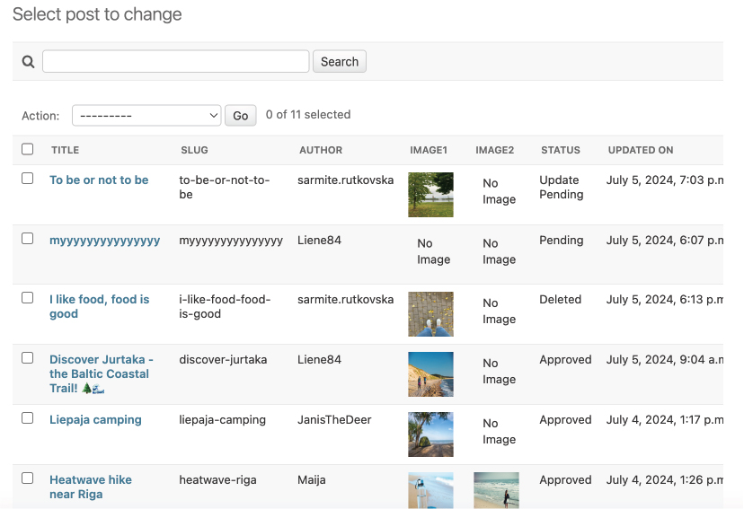

- The post model in the admin panel lets admins oversee user-generated content, including author details, titles, slugs, content, creation and update dates, status, categories, and associated images.
- Admins can filter posts by status and categories, and search through titles and content for efficient moderation.
- The post admin view includes small previews of images if they are available, making it easier for admins to manage visual content.

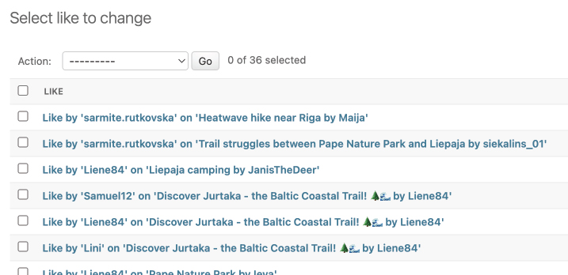

- The admin panel features a model for likes, ensuring that each user can only like a post once, and allowing admins to monitor like activity.

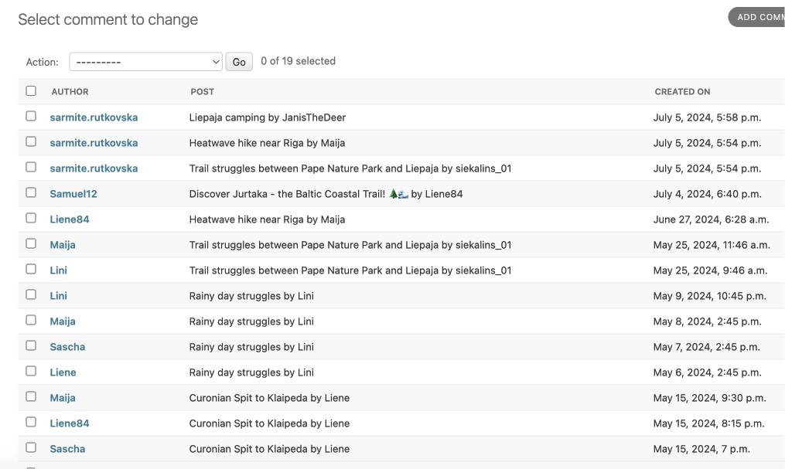

- Comment management is facilitated with the comment model, showing the post, author, content, and timestamps for each comment.

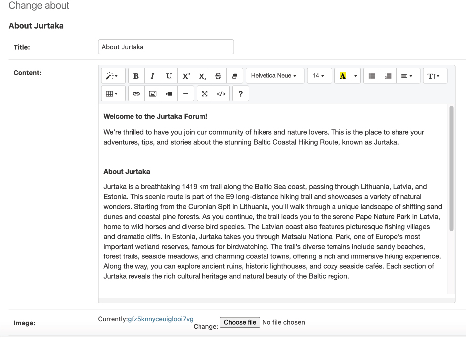

- Admins can edit and moderate About content using the Summernote editor integrated into the About model, enhancing content management capabilities.


- The admin panel provides a list display for contacts, showing user information, email, subject, creation date, and status for better communication tracking.
- Filters and search fields are available in the contact admin view to help admins manage inquiries based on status, subject, and user details.

## Future Features

1. Implement a feature that allows users to see posts categorized by the most popular posts, enabling them to view the most useful content first.
2. Enable users to edit and delete their comments so they can update or remove irrelevant content.
3. Add an option for users to delete their accounts, allowing them to opt out of all services.
4. Implement a view counter so users can see how many times a post has been viewed, providing insight into the post's popularity.
5. Create a feature that displays a list of all the sections of the hike, helping users to learn more about the hike.
6. Display hiking section ratings on posts so users can see feedback from other users.
7. Enable users to rate hiking sections, offering feedback to other users.
8. Allow users to add hiking sections to posts, providing more detailed information.

[Return to contents list](#table-of-contents)

# 5. Technologies Used

## Languages and Frameworks Used

-   [HTML5](https://en.wikipedia.org/wiki/HTML5)
-   [CSS3](https://en.wikipedia.org/wiki/Cascading_Style_Sheets)
-   [JavaScript](https://en.wikipedia.org/wiki/JavaScript)
-   [Django](https://en.wikipedia.org/wiki/Django_(web_framework))

## Frameworks, Libraries and Programs Used

1. [Git:](https://git-scm.com/)
    Used for version control via Gitpod terminal for commits and pushes to GitHub.
1. [GitHub:](https://github.com/)
    Used to store the project's code after being pushed from Git.
1. [Heroku](https://heroku.com/)
    Used for deploying the project.
1. [Bootstrap 5](https://getbootstrap.com/)
    Used for creating the design and layout of the page.
1. [Font Awesome:](https://fontawesome.com/)
    Used to add icons for aesthetic and UX purposes.
1. [Coudinary](https://cloudinary.com/)
    Used for image management.
1. [Balsamiq](https://balsamiq.com/)
    Used to create wireframes during the design process.
1. [Adobe Stock](https://www.adobe.com/)
    Used to source the background image.
1. [Adobe Illustrator](https://www.adobe.com/)
    Used to create the logo.
1. [Lucidchart](https://www.lucidchart.com)
   Used to create site maps and database schemas.
1. [Google Fonts:](https://fonts.google.com/)
    Used to import fonts for styling.
1. [Google Photos:](https://www.google.com/photos/about/) 
    Used for finding placeholder images for the site.

[Return to contents list](#table-of-contents)

# 6. Validation and Testing

See [testing.md](testing.md) for all testing and validation.

# 7. Bugs and Fixes

1. NoReverseMatch Error on Post Approval

After adding a post, users encountered a "NoReverseMatch" error.

**Reason:** There is a unique slug required for each post to generate a correct URL for approved posts. Since users do not provide slugs when adding posts, the system cannot match requested URLs with post details and this leads to an error.

**Fix:** The bug was fixed by implementing an automatic slug generator using the 'slugify' library in Django models:

`from django.utils.text import slugify`

and adding a method that generates a slug automatically:

```python
def save(self, *args, **kwargs):
    if not self.slug:
        self.slug = slugify(self.title)
    super().save(*args, **kwargs)
```

This overrides the 'save' method in the model. First, it checks if a slug already exists, if not, it generates one.  In this way the title is converted to a slug and each post has a unique identifier in its URL.

2. 404 Error on post_detail View for Posts Awaiting Approval

When an edited post was submitted, the post_detail view could not retrieve the post, causing a 404 error. 

**Reason:** When a post is edited, its status is set to "update pending" (status=3). The bug was caused because the post_detail view was retrieving only posts with the "approved" status (status=1). The edited post with its status set to "update pending" was not available to the post_detail view, resulting in a "Page not found" error.

**Fix:** The bug was fixed by adjusting the post_detail view to include both statuses:

`queryset = Post.objects.filter(slug=slug, status__in=[1, 3])`

This makes it possible for users to view details of their edited posts while awaiting admin approval. Also in this way the original slug is used in the redirection, avoiding conflicts related to URLs.

3. Comment Count Issue on Search Results Page

Comments were not counted on the search results page.

**Reason:** Comments were not being counted on the search results page due to the way Django manages relations between the Post, Comment and Like models using foreign keys. On the post_list page counts were accessed using `post.comments.count()` and `post.likes.count()`
However, on search_results page Django did not automatically count comments for each post. 

**Fix:** This was fixed by importing 'Q' class from django.db.models and adding `annotate(comment_count=Count('comments'))` to the queryset in the search_results view. This annotation instructs Django to calculate and include the comment count for each post.

4. UX Confusion with 'Back' Button

Initially, the individual post page featured a 'Back' button intended to enhance user navigation. Users could view individual posts either from the main home page or from the search results. The 'Back' button was designed to bring them back to the home page or the search results, respectively. This was accomplished by adding the `HTTP_REFERER` header to the post_detail view and setting the referer variable in the post_detail template. The `HTTP_REFERER` header indicates the URL of the page from which the user navigated, ensuring that the 'Back' button would bring users back to their previous page, thus enhancing the user experience.

However, the implementation of this feature led to unintended user experience issues. When users submitted comments or edited their posts, the 'Back' button did not function as expected. Instead of returning users to their previous page, it often resulted in confusion, as the 'Back' button would not work. 

To avoid this confusion the 'Back' button was removed from the post_detail template. The remaining buttons are:
'Exit' button on account related templates and 'Back' button on the post_create template.

5. Comment Count Not Updating After Adding Comment

The code did not update the comment_count variable after saving a new comment. 

**Reason:** Even though a new comment was added succesfully, the count displayed in the template `{{ comment_count }}` remained the same until the page was refreshed. This happened because the variable was not recalculated and rendered in the template.

**Fix:** This was fixed by adding changes to post_detail view:
`comment_count = post.comments.count()` was added after saving a new comment. This insures that the comment count reflexts the current number of comments after a new comment is added. 
The view was adjusted with `return redirect('post_detail', slug=slug)` This ensures that the page is updated with the new comment count without requiring a manual refresh.

6. Conflict in Form Submissions for Like/Unlike and Comment

When users liked or unliked a post, a "required field" message appeared under the comment form.

**Reason:** Both the 'like' and 'comment' forms were submitting to the same post_detail URL. This caused confusion because the server expected data from both forms simultaneously, and this lead to the error. 

**Fix:** This was fixed by adding a separate 'like_post' URL for handling likes. A hidden input field was added to the form, which now captures the current URL, allowing the server to redirect users back to the original post detail page after processing the like action. This separation of handling likes and comments prevents conflicts between the submissions.

7. Image Upload Failure

When adding a post, users were unable to upload images.

**Reason:**  Absence of the Pillow library, which is necessary for handling image files in Django. Additionally, the storage backend for Cloudinary was not properly configured in the Django settings.

**Fix:** Installed the Pillow library: `pip install Pillow==8.2.0` and add necessary dependencies to the settings file:
- Defined `MEDIA_URL = '/media/'`.
- Configured `DEFAULT_FILE_STORAGE = 'cloudinary_storage.storage.MediaCloudinaryStorage'`.

8. Incorrect Comment Count in 'Top' Post View

In the 'Top' Post View, comment count is much higher than it should be

**Possible reason**: Error in calculating like and comment count in the queryset.

**Tried Fixes**: 
- Annotated the queryset to calculate comment count.
- Used `ExpressionWrapper` to ensure accurate calculation of comment count.
- Utilized `F` expressions to reference and aggregate comment count correctly.
- Specified `IntegerField` to ensure that the field type used for storing comment count is appropriate and avoids any type-related issues.

**Possible Fix**: Add `comment_count` and `likes_count` as fields directly on the Post model, override the `save()` method on the Comment and Likes models to update these fields whenever a new comment or like is added. 

**Solution Implemented**: Due to time constraints and the persistence of the issue, the affected category had to be temporarily removed from the site. This decision ensures data integrity and user experience until a more robust solution can be implemented.

[Return to contents list](#table-of-contents)

# 8. Deployment

## Deployment to Heroku

The project was deployed to [Heroku](https://dashboard.heroku.com/). These steps were followed:

1. Log in to your Heroku account.
2. Create a new app by choosing a name and region, then click "Create app."
3. Select GitHub as the deployment method and connect to your GitHub repository using the search field.
4. For the initial deployment, add a DISABLE_COLLECTSTATIC key with the value 1 in your Config Vars. Navigate to Settings -> Config Vars -> Reveal Config Vars -> Add the key and value -> Save.
5. In your project's IDE, run `pip3 install gunicorn~=20.1` and add it to your project's requirements.
6. Create a Procfile at the root directory of your project. Declare the process type as web and add a start command: `web: gunicorn project_name.wsgi`.
7. Set `DEBUG` to `False` in your project settings file and add `'.herokuapp.com'` hostname to the `ALLOWED_HOSTS` list.
8. Push your code changes to GitHub.
9. Deploy your application by navigating to your Heroku app dashboard, locating the Deploy section, ensuring your GitHub repository is connected, and manually deploying by clicking "Deploy Branch".
10. To connect to your database, add yout database URL to the Config Vars.  Use `DATABASE_URL` as the key and your database URL as the value.
11. To conect to your Cloudinary , add your Cloudinary URL to the Config Vars. Use `CLOUDINARY_URL` as the key and your Cloudinary URL as the value.

### Deployment with Static Files

1. In your project's IDE, run `pip3 install whitenoise~=5.3.0`, and includei it in your project's requirements.
2. Configure WhiteNoise by adding `whitenoise.middleware.WhiteNoiseMiddleware` to the `MIDDLEWARE` list in your project's settings file, placed  just after Django's `SecurityMiddleware`.
3. Define the `STATIC_ROOT` path in your settings file: `STATIC_ROOT = os.path.join(BASE_DIR, 'staticfiles')` and run the `collectstatic` command in your terminal.
4. Create a `runtime.txt` file to your app's root directory. Specify the exact Python version required by Heroku.
5. Ensure `DEBUG` is set to `False` in your project settings file, and push your changes to GitHub.
6. On the Heroku app dashboard, remove the `DISABLE_COLLECTSTATIC` key/value pair from Config Vars and manually redeploy your project by clicking "Deploy Branch".

## Cloning and Forking the Repository

### Clone the Repository

1. Log in to your Github account.
2. Find the [Jurtaka](https://github.com/lienebriede/jurtaka) repository.
3. Click on the "Code" button near the top right of the repository's page to reveal the cloning options. Choose either HTTPS or SSH, depending on your preference.
4. Click on the clipboard icon next to the URL to copy it to your clipboard.
5. Open your Git Bash (Windows) or Terminal (macOS/Linux) application.
7. Use the `cd` command to change the current working directory to the location where you want to clone the repository: `cd path/to/desired-directory`.
8. Type `git clone` followed by the URL you copied earlier. For example (if using HTTPS) :
`git clone https://github.com/YOUR-USERNAME/jurtaka.git`.
9. Press 'Enter' to create your local clone of the repository.

### Fork the Repository

1. Log in to your Github account.
2. Find the [Jurtaka](https://github.com/lienebriede/jurtaka) repository.
3. Click on the "Fork" button in the upper right-hand corner of the repository's page. This creates a copy (fork) of the repository under your GitHub account.

[Return to contents list](#table-of-contents)

# 9. Credits

### Code

This code would not have been written and functional without the invaluable assistance from [Stack Overflow](https://stackoverflow.com/) and the dedicated support from tutors at Code Institute. 

Massive thanks!

### Content

All content was written by the developer with the help of [ChatGPT](https://chatgpt.com/).

[Return to contents list](#table-of-contents)
